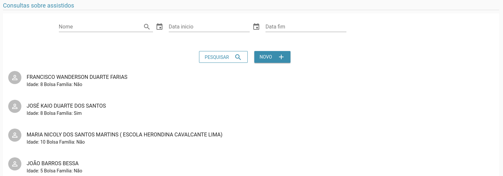

# Assistidos

> **Diponibilidade:**
> ADMINISTRADOR, COORDENADOR, COLABORADOR

A funcionalidade de manter assistidos é possível listar, alterar, excluir e incluir um assistido. O cadastro de assistidos tanto pode ser utilizado por este menu, quanto um assistido também será cadastrado quando cadastrado no [cadastro geral](./cadastro-geral.md)

### Listagem
Na listagem é possível ver os assistidos até então cadastrados.

Na tela acima é possível listar os assistidos já cadastrados, bem como filtrá-los pelo nome, quanto por faixa de idade. Definindo o mês e ano de início e o mês e ano final.

### Inclusão
 No botão Novo é possível incluir um novo assistido, como vemos abaixo:

### Detalhar
Ao clicar sobre um assistido na tela de listagem, você é redirecionado para a tela de detalhar

### Alterar
Além de ser possível atualizar, como vemos abaixo:

Como podemos ver na opção acima, também é possível excluir uma escola, esta operação é inrreversível, então deve-se ter o máximo cuidado.