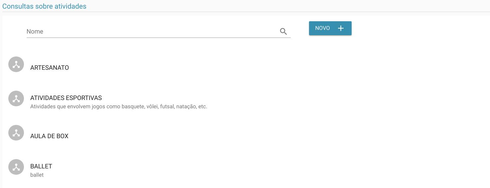
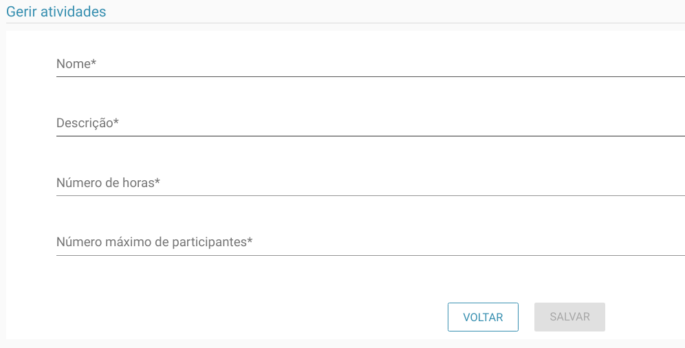
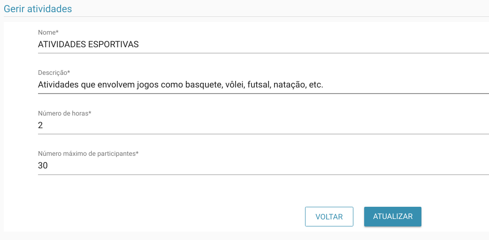

# Atividades

> **Diponibilidade:**
> ADMINISTRADOR, COORDENADOR, COLABORADOR

A funcionalidade de manter atividades é possível listar, altera e incluir uma nova atividade. Este cadastro será utilizado no [cadastro geral](./cadastro-geral.md)

### Listagem

Na tela acima é possível listar as atividades já cadastradas, bem como filtrá-las pelo nome.

### Inclusão
No botão Novo é possível incluir uma nova atividade como vemos abaixo.

### Alterar
Além de ser possível atualizar, como vemos abaixo:
