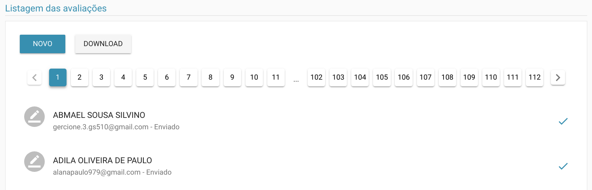
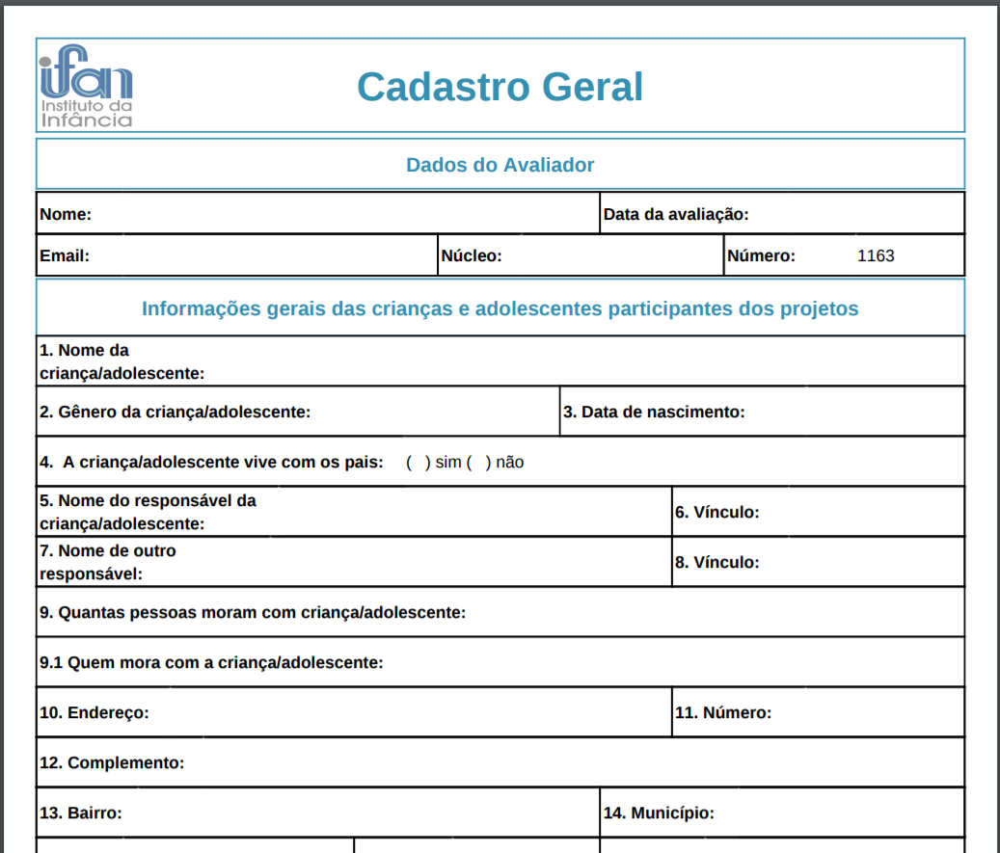
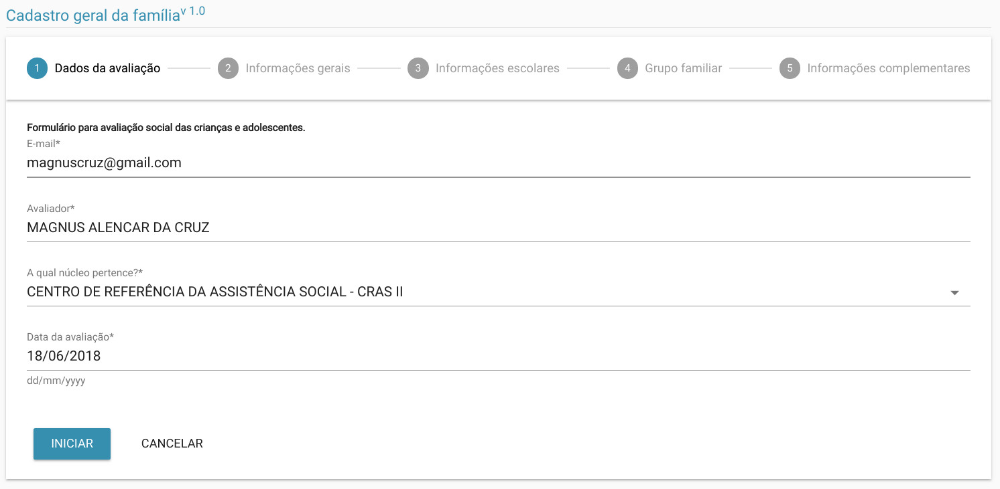
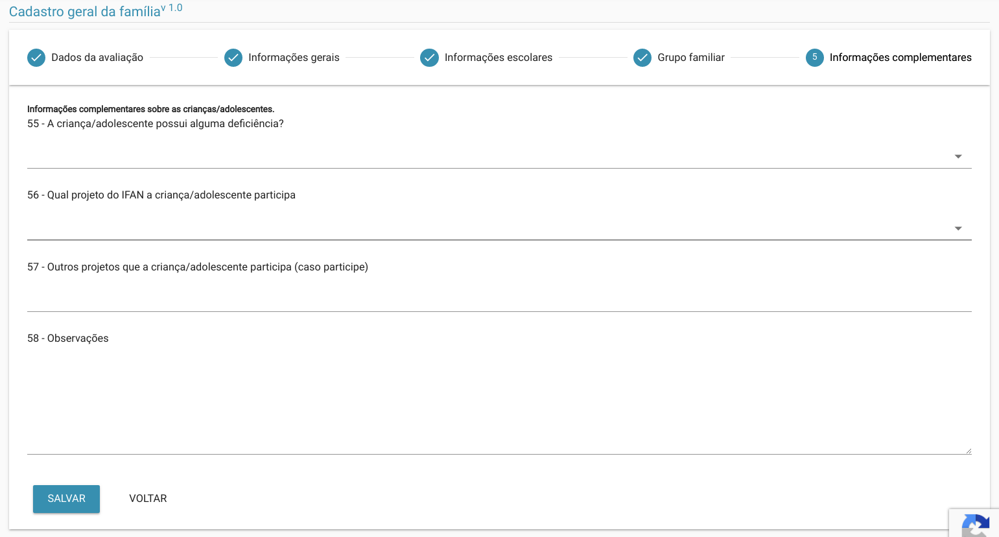
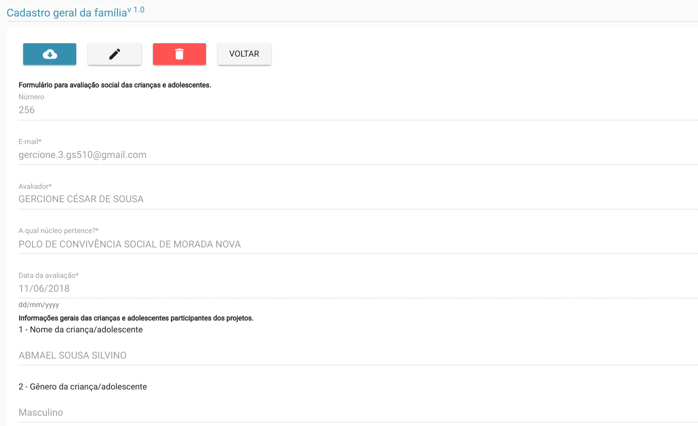
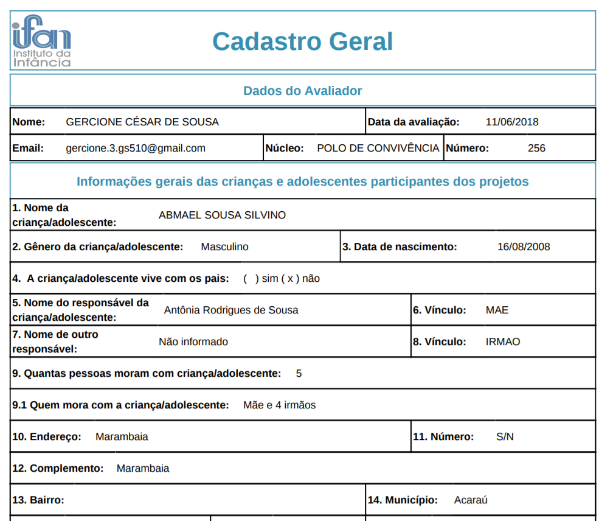
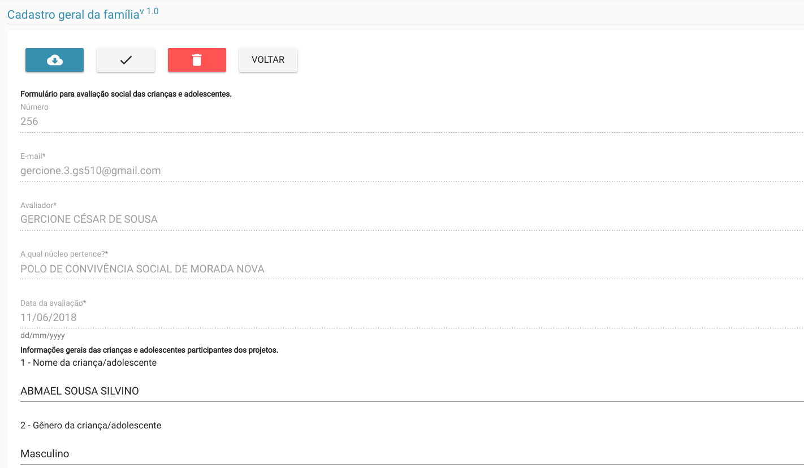

# Cadastro Geral

> **Diponibilidade:**
> ADMINISTRADOR, COORDENADOR, COLABORADOR

Esta funcionalidade corresponde ao censo sócio-econômico principalmente sobre os assistidos do IFAN. 
O cadastro do censo ocorre num formato off-line, ou seja, os dados cadastrados ao final estão apenas na máquina do avaliador, sendo necessário clicar em cima do cadastro realizado para que o sistema tente enviar o cadastro para o banco de dados da aplicação onde ficará salvo definitivamente. Isso possibilita que um avaliador possa responder a vários cadastros sem a necessidade de estar online e quando tiver disponibilidade de rede poder encaminhar as avaliações.

Inicialmente temos a tela de listagem dos cadastros já realizados. 
Caso o usuário seja um ADMISNISTRADOR ou COORDENADOR ele poderá ver todos os cadastros realizados até o momento, porém se o usuário for um COLABORADOR ele só conseguirá ver apenas os cadastros realizados por ele mesmo.

No topo da lista sempre aparecerá as avaliações que ainda não foram enviadas. Se não existir avaliações a serem enviadas a ordem das avaliações seguirá a ordem alfabética natural.

Na imagem acima podemos ver ainda mais 2 opções:
  - Novo
  - Download

### Download
Na opção download será possível baixar uma versão da avaliação em PDF, com as questões em branco prontas para serem impressas e respondidas a mão.

### Novo
Na opção Novo teremos inicío a um novo cadastro.

## Cadastro
Como podemos ver na imagem abaixo, o cadastro se iniciará no Passo 1 - Dados da avaliação.

### Dados da avaliação
Em dados da avaliação temos os dados do avaliador como email e nome, bem como o núcleo ao qual este avaliador está vinculado e por último a data da avaliação.

A maior parte dos dados serão preenchidos automaticamente, exceto o núcleo que também é de preenchimento obrigatório.

Outros passos se seguirão como:
  - Informações gerais
  - Informações escolares
  - Grupo familiar
  - Informações complementares

### Informações gerais
Neste passo, temos informações sobre a criança/adolescente como nome, sexo, data de nascimento entre outros.
O nome e a data de nascimento são de preenchimento obrigatório.

### Informações escolares
Neste passo, temos informações sobre a escola onde a criança/adolescente estuda, série, turno entre outros.

### Grupo familiar
Neste passo, temos informações sobre os responsáveis pela criança/adolescente como vínculo entre eles, renda, ocupação entre outros.

### Informações complementares
Neste passo, temos a informação de qual projeto a criança/adolescente participa, se possui deficiência entre outras informações como as observações que é um espaço reservado do avaliador para descrever seu sentimento e detalhes percebidos em loco.

Nesta última tela, se todos os campos obrigatórios já mencionados, o botão salvar estará habilitado para que o cadastro seja salvo localmente para que posteriormente seja enviado para base de dados.

## Detalhar

Após o envio dos dados para base de dados é possível detalhar os dados enviados. Ao detalhar mais opções aparecem da direita pra esquerda na imagem abaixo, como:
  - Download dos dados cadastrados
  - Alterar/Confirmar alteração
  - Excluir cadastro*
  - Voltar

### Download
Ao clicar faz o download de um arquivo pdf num formato padrão com os dados cadastrados.

### Alterar/Confirmar
Ao clicar em Alterar o botão Confirmar aparecerá no seu lugar e os campos do formulário serão abertos para edição.

Perceba pela imagem acima que os dados relativos ao passo denominado [Dados da avaliação](./cadastro-geral.md#dados-da-avaliacao) não serão possível de alterar, apenas os itens das questão de `01 a 58` estarão abertos para edição. Após realizar todas as alterações necessárias, clique no botão confirmar, para garantir que as mudanças surtirão efeito.

### Excluir
Na opção excluir é possível excluir o cadastro, esta opção está disponível apenas para usuários ADMINISTRADORES e COORDENADORES. 
Esta opção deverá ser utilizada com cuidado, pois excluirá permanentemente uma avaliação cadastrada. Porém o sistema, ao clicar sobre a opção solicitará uma última confirmação por parte do usuário.

### Voltar
A opção voltar, possibilita retornar a tela anterior, seja a de [listagem das avaliações](./dashboard.md#avaliacoes) ou a tela de [filtragem no dashboard.](./dashboard.md#avaliacoes) 

