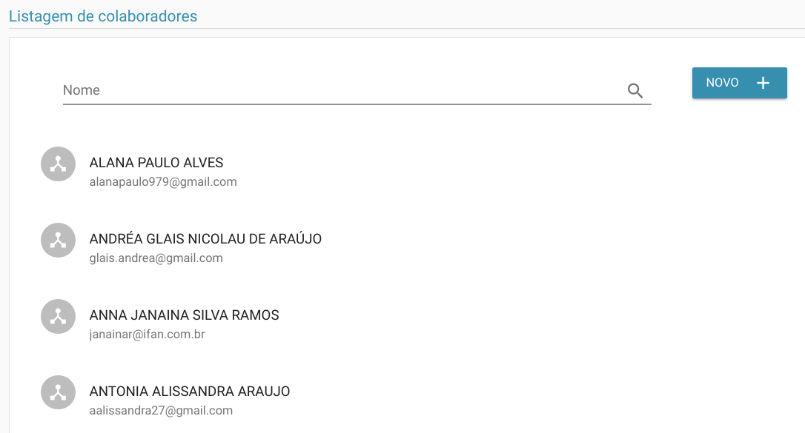
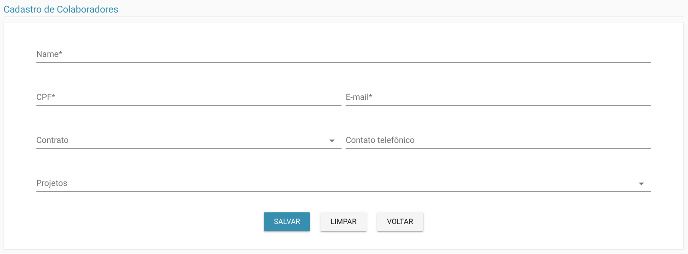
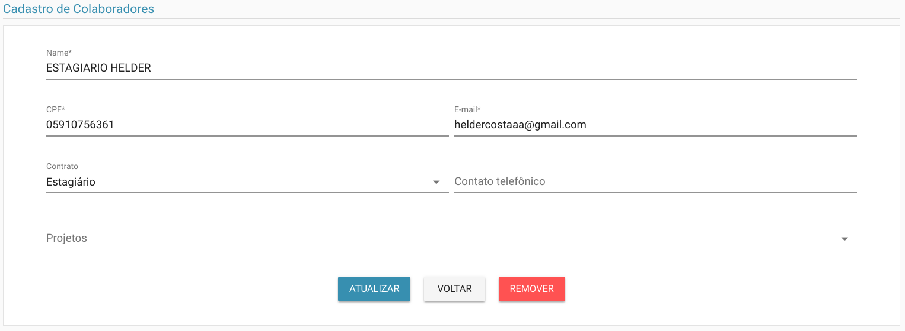

# Colaboradores

> **Diponibilidade:**
> ADMINISTRADOR, COORDENADOR

A funcionalidade de manter colaboradores é possível listar, alterar, excluir e incluir um colaborador.

### Listagem
Na listagem é possível ver os colaboradores até então cadastrados.

Na tela acima é possível listar os colaboradores já cadastrados, bem como filtrá-las pelo nome.

### Inclusão
 No botão Novo é possível incluir um novo colaborador como vemos abaixo.

### Alterar
Além de ser possível atualizar, como vemos abaixo:

Como podemos ver na opção acima, também é possível excluir um colaborador.