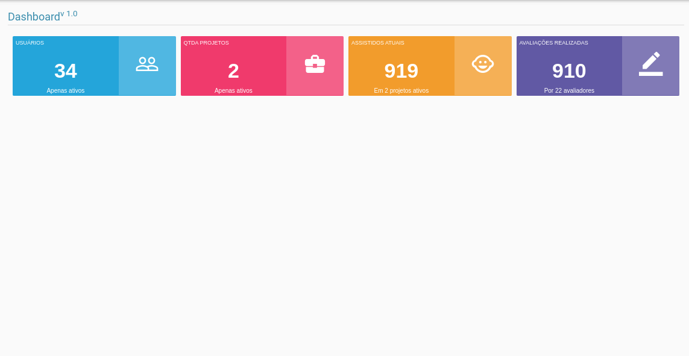
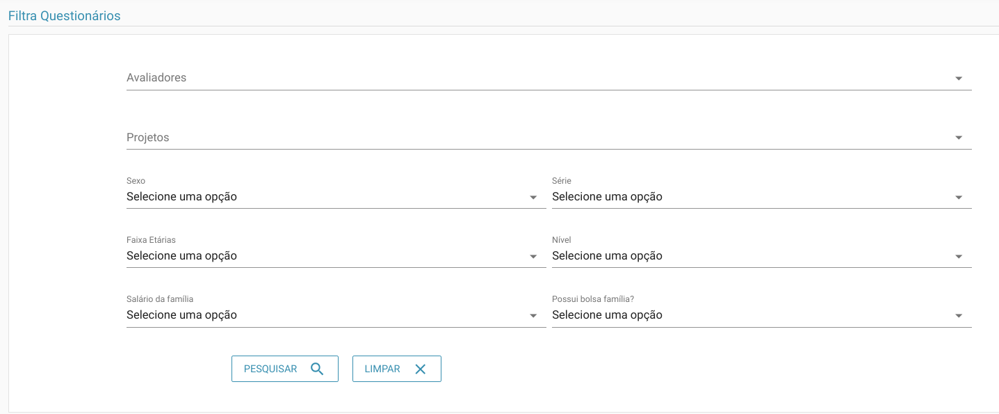
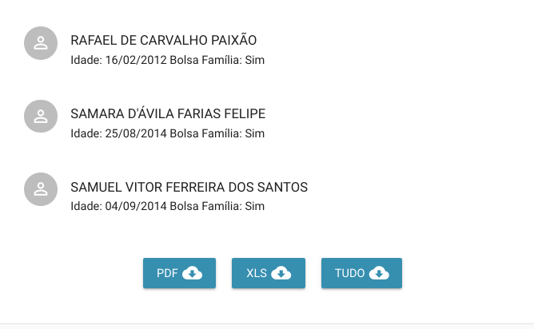

# Dashboard

> **Diponibilidade:**
> Todos os tipos de usuários**
>
>**Observação:** `Ao clicar em algum card, o usuário só terá acesso a funcionalidade específica se tiver acesso a funcionalidade pelo menu.`

O Dashboard, atualmente na versão 1.0, tem por função fornecer uma visão geral sobre o estado atual do sistema de forma mais visual. Cada card possui informações relevantes sobre o sistema, além de ao clicar sobre os cards ser possível redirecionar para funcionalidades do sistema, como veremos abaixo.

## Usuarios

É o primeiro card na cor azul, que sempre vai informar a quantidade de usuário ativos no sistema. Clicando sobre ele você será redirecionado para [pesquisa de usuário](./usuarios.md)

## Projetos

O card de cor vermelha trás informações sobre a quantidade de projetos ativos no sistema. Ao clicar sobre o card você será redirecionado para [consulta de projetos](./projetos.md)

## Assistidos

Já o card de cor laranja informa a quantidade de assistidos cadastrados em todos os projetos. No [cadastro de assistidos](./assistidos.md#cadastro-de-assistidos), como veremos mais a frente é possível vincular um assistido ao projeto em que participa. Neste card apenas são mostrados a quantidade de assistidos que estão vinculados a algum projeto. Ou seja, este número pode não representar o número total de assistidos, caso algum assistido tenha sido cadastrado sem vínculo com um projeto. Caso o assistido participe de 2 ou mais projeto concomitantemente, ele será contabilizado 1 vez.
Ao clicar neste card você será redirecionado para [consulta de assistidos](./assistidos.md#consulta-de-assistidos)

## Avaliações

No último card, o roxo, temos a quantidade total de cadastros socio-econômico realizados pelo número de avaliadores apresentados. Ou seja, temos o número de cadastros que foram feitos pelo número de avaliadores. 

Ao clicar sobre o card temos uma tela exclusiva de filtragem dos cadastros, como podemos ver abaixo:

Ou seja, o usuário possui vários opções de filtro. Ao selecionar os filtros, basta clicar em pesquisar. O sistema automaticamente irá retornar a lista de cadastros que estão de acordo com os filtros selecionados, como podemos ver abaixo:

Podemos ver pela imagem acima que ao execultar a pesquisa sobre os dados selecionados no filtro, temos os resultados sendo listados.
Além dos resultados é possível notar a presença de 3 botões, são eles:
  - PDF
  - XLS
  - TUDO
### PDF
Ao clicar nesta opção, será gerado um relatório no formato PDF, utilizando os mesmos filtros da consulta, ou seja, o arquivo do tipo PDF será gerado com os mesmos dados da consulta. O retorno em formato PDF é um formato limitado em quantidade de atributos.

### XLS
Já o arquivo no formato XML, é similar ao relatório em PDF, com a diferença apenas do formato, ou seja, ele retorna os mesmos dados da consulta e com uma quantidade limitada de atributos.

### TUDO
Nesta opção o relatório será em formato XLS, porém todos os dados do cadastro serão impressos. Cada linha do relatório representa os dados de uma criança/adolecente cadastrados. O uso deste relatório deve ser feito com cautela uma vez que consome mais recursos computacionais proporcionalmente a quantidade de dados resultante da filtragem.
