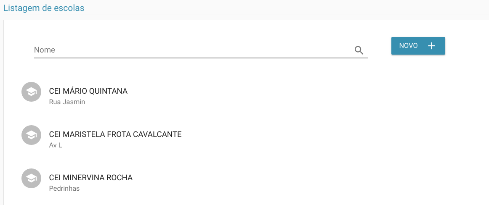
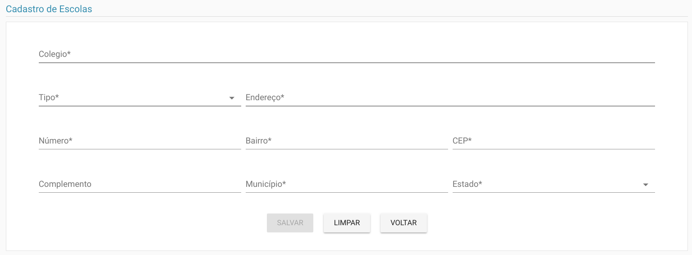
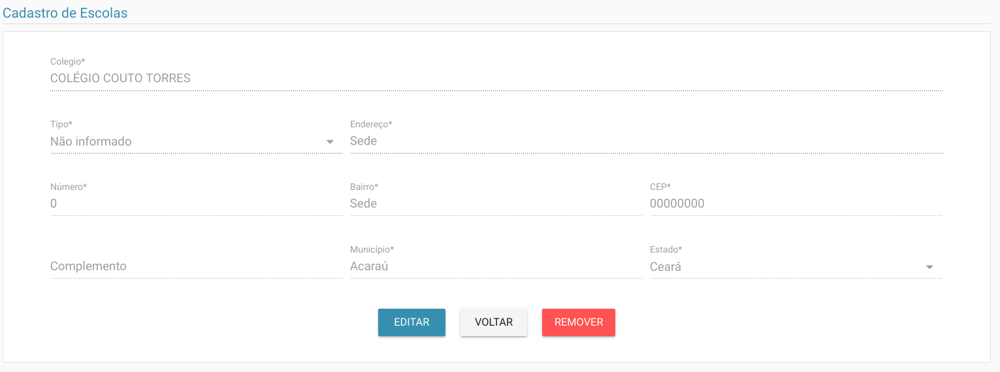
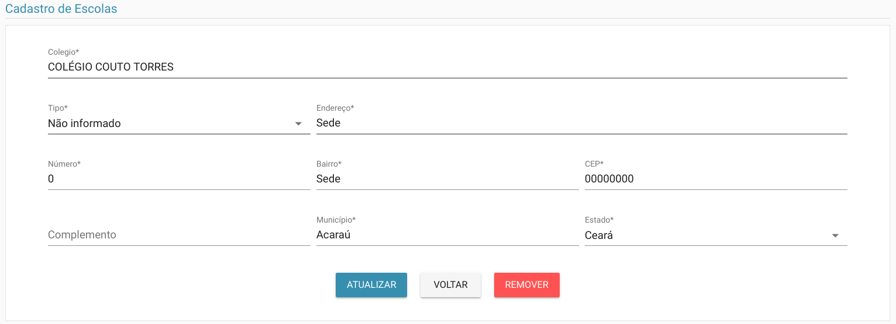

# Escolas

> **Diponibilidade:**
> ADMINISTRADOR, COORDENADOR

A funcionalidade de manter escolas é possível listar, alterar, excluir e incluir uma escola. O cadastro de escolas é utilizado no [cadastro geral](./cadastro-geral.md)

### Listagem
Na listagem é possível ver os colaboradores até então cadastrados.

Na tela acima é possível listar os colaboradores já cadastrados, bem como filtrá-las pelo nome.

### Inclusão
 No botão Novo é possível incluir uma nova escola como vemos abaixo.

### Detalhar
Ao clicar sobre a escola na tela de listagem, você é redirecionado para a tela de detalhar

### Alterar
Além de ser possível atualizar, como vemos abaixo:

Como podemos ver na opção acima, também é possível excluir uma escola, esta operação é inrreversível, então deve-se ter o máximo cuidado.