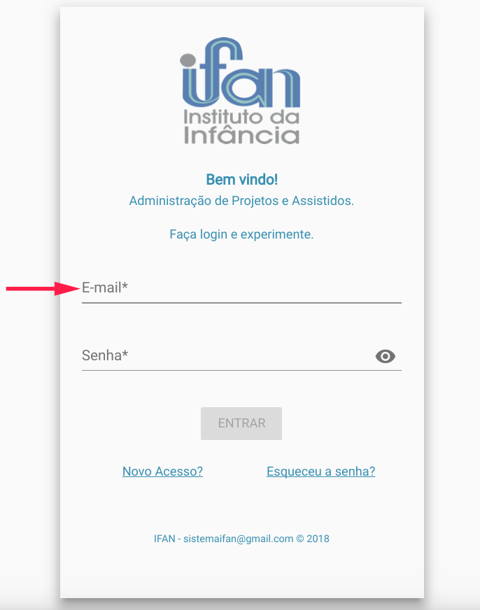
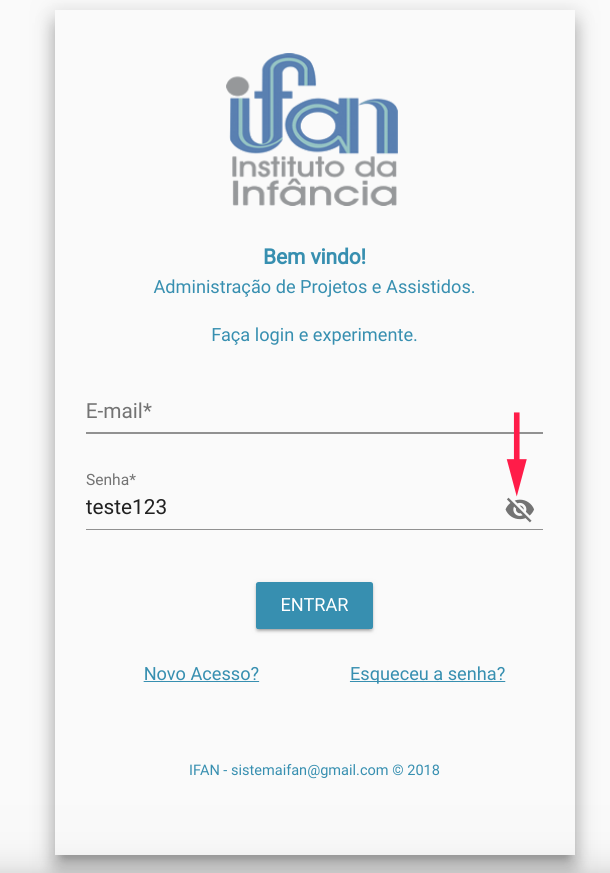
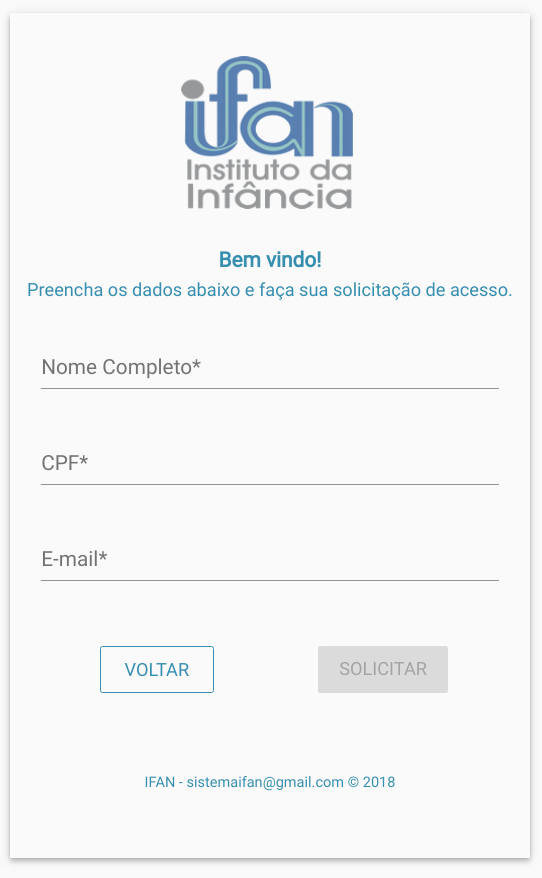
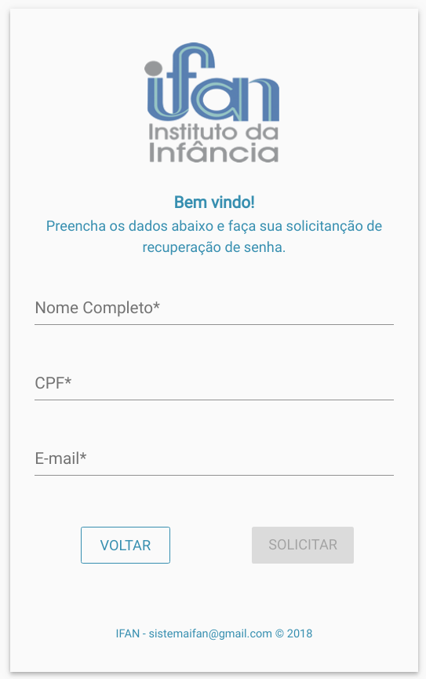

# Login

Esta é a tela inicial do sistema, onde 3 opções são disponibilizadas:
  - Loggar
  - Novo acesso
  - Esqueceu a senha

### Loggar
Nesta opção o usuário só precisa informar o usuário e senha cadastrados no sistema e clicar sobre o botão Entrar.

Ao digitar é possível ver ou esconder a senha que está sendo digitada.

### Novo acesso
Já a opção de novo acesso, irá redirecionar para outra tela pra informar dados como nome completo, cpf e email. Após isso a [solicitação de acesso](./solicitacoes.md) é criada e enviada a qualquer usuário do tipo ADMINISTRADOR que poderá aprovar ou não o acesso. Concomitantemente um email será encaminhado com uma senha provisória para confirmar se o email informado realmente é do usuário solicitante.

No primeiro acesso o sistema pedirá para o usuário definir uma senha permanente.

### Esqueceu a senha
Caso o usuário esqueça a senha, ele pode solicitar um reset da senha, onde ele terá que informar os dados informados no cadastro e será encaminhado um email com a nova senha provisória.

