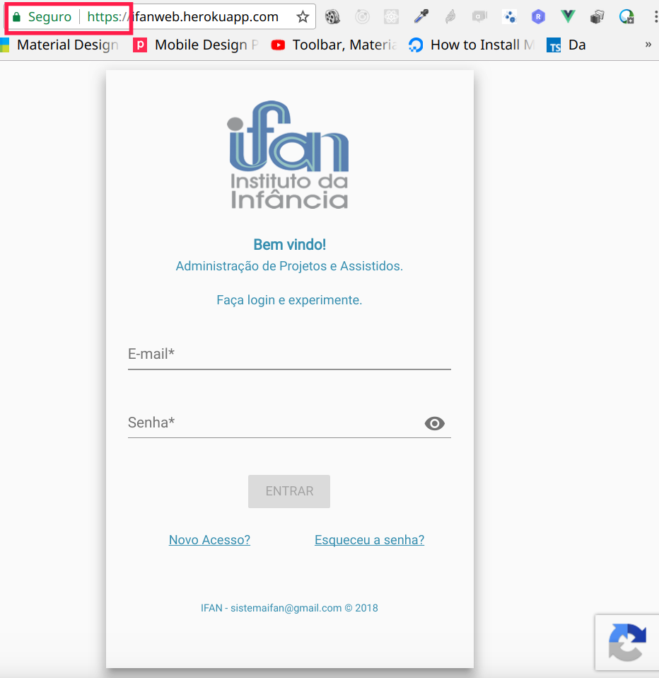

# Bem vindo ao sistema IFAN

O Sistema IFAN é uma plataforma formada por diversas aplicações, que têm por objetivo controlar e dar maior transparência para as atividades coordenadas pelo Instituto da Infância.

A plataforma, como podemos ver abaixo, foi criada com grande preocupação na segurança dos dados e como estes dadão são trafegados. Os dados trafegam  criptografados.

 

Também possui o mecanismo do google reCatpcha que impede ataques a de qualquer página da aplicação.

> © iSystem Solution - 2018