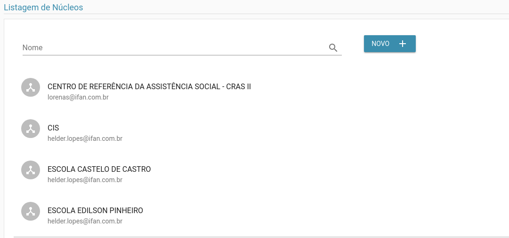

# Núcleos

> **Diponibilidade:**
> ADMINISTRADOR, COORDENADOR

A funcionalidade de manter núcleos é possível listar, alterar, excluir e incluir um núcleo. O cadastro de núcleos é utilizado no [cadastro geral](./cadastro-geral.md)

### Listagem
Na listagem é possível ver os núcleos até então cadastrados.

Na tela acima é possível listar os núcleos já cadastrados, bem como filtrá-las pelo nome.

### Inclusão
 No botão Novo é possível incluir um novo núcleo como vemos abaixo.

### Detalhar
Ao clicar sobre um núcleo na tela de listagem, você é redirecionado para a tela de detalhar

### Alterar
Além de ser possível atualizar, como vemos abaixo:

Como podemos ver na opção acima, também é possível excluir uma núcleo, esta operação é inrreversível, então deve-se ter o máximo cuidado.