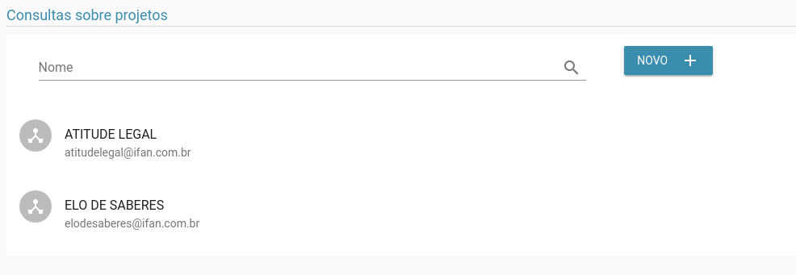
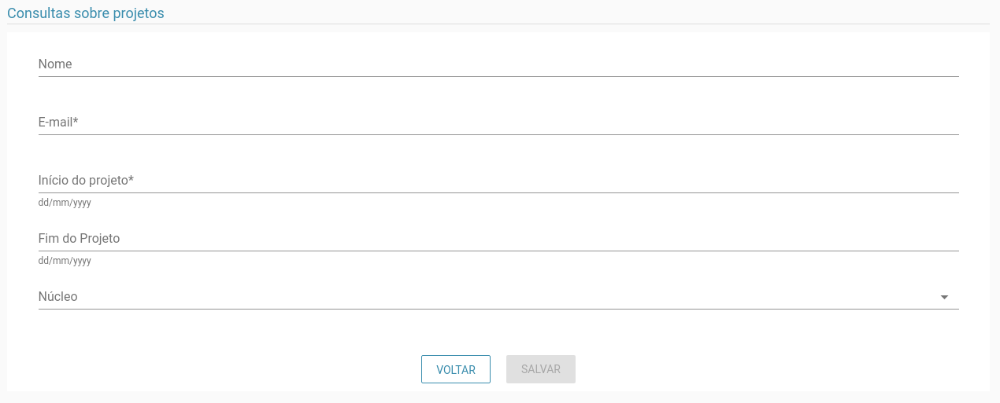
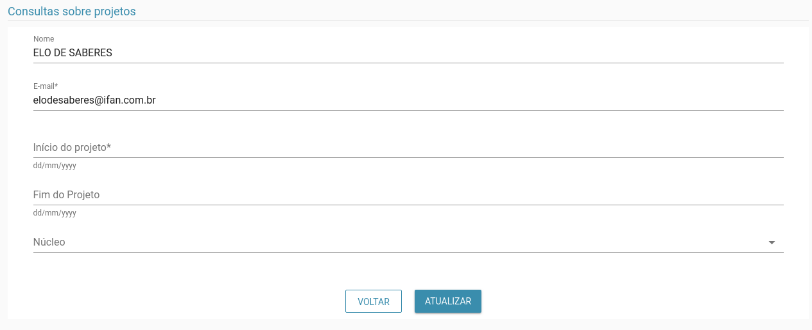

# Projetos

> **Diponibilidade:**
> ADMINISTRADOR, COORDENADOR, COLABORADOR

A funcionalidade de manter projetos é possível listar, alterar, excluir e incluir um projeto. Este cadastro é utilizado em vários locais do sistema.

### Listagem
Na listagem é possível ver os projetos até então cadastrados.

Na tela acima é possível listar os projetos já cadastrados, bem como filtrá-los pelo nome.

### Inclusão
 No botão Novo é possível incluir um novo projeto, como vemos abaixo:

### Alterar
Além de ser possível atualizar, como vemos abaixo:

Como podemos ver na opção acima, também é possível excluir um projeto, esta operação é inrreversível, então deve-se ter o máximo cuidado.