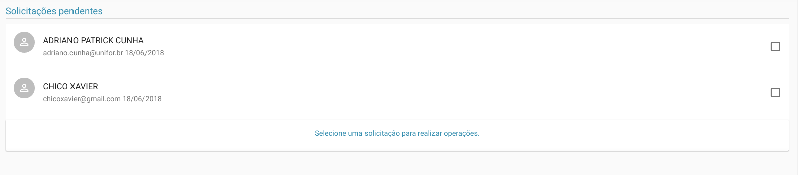
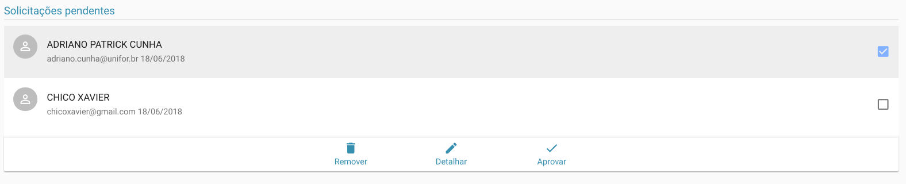
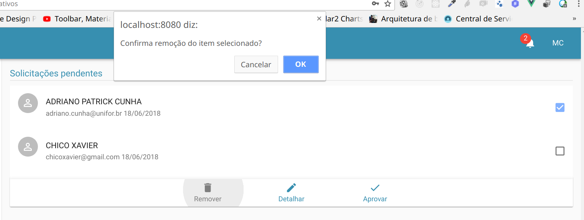
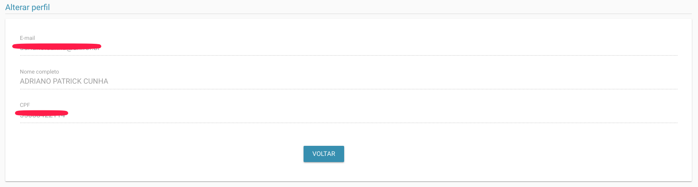
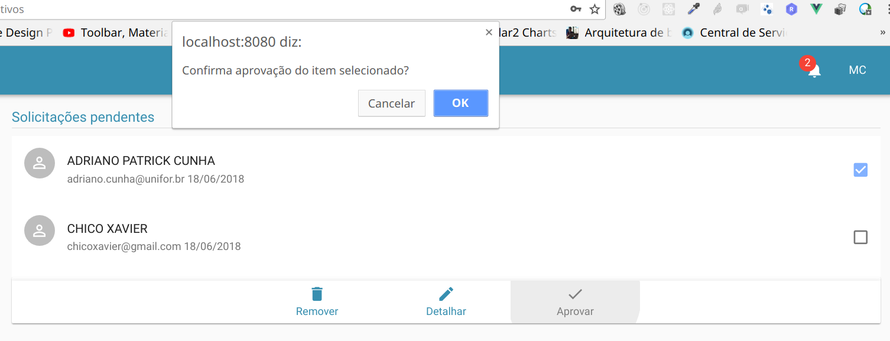

# Solicitações

> **Diponibilidade:**
> ADMINISTRADOR

Esta funcionalidade lista todas as solicitações de acesso realizadas pela internet e que estejam pendentes de aprovação.

Inicialmente temos a lista de solicitações, como vemos abaixo:

Ao selecionar um ou mais solicitações, um menu de opções aparecerá, com operações que podem ser realizadas sobre as solicitações selecionadas.

As opções disponíveis são:
  - Remover
  - Detalhar
  - Aprovar

### Remover
Nesta opção o usuário removerá definitivamente todas as solicitações selecionadas. Esta opção requer bastante cuidado. Porém o sistema irá solicitar uma confirmação que pode ser cancelada clicando sobre cancelar ou confirmada clicando em OK

### Detalhar
Esta opção diferente das demais, só é possível selecionando apenas 1 item, caso seja selecionado mais de um item, uma mensagem de aviso será mostrado, informando que apenas 1 item pode ser detalhado por vez.

Antes de aprovar alguma solicitação o ADMINISTRADOR poderá detalhar os dados do solicitante pra confirmar sua identidade.

### Aprovar
Na aprovação de todas as solicitações serão aprovadas de uma única vez. Porém o sistema ainda pedirá a confirmação do usuário que pode ser cancelada clicando sobre cancelar ou confirmada clicando em OK

Todas as vezes que um usuário do tipo ADMINISTRADOR logar no sistema ele visualizará um sino de notificação, informando a quantidade de solicitações pendentes. Ao clicar sobre o sino ele será redirecionado a tela de Solicitações Pendentes automaticamente.
