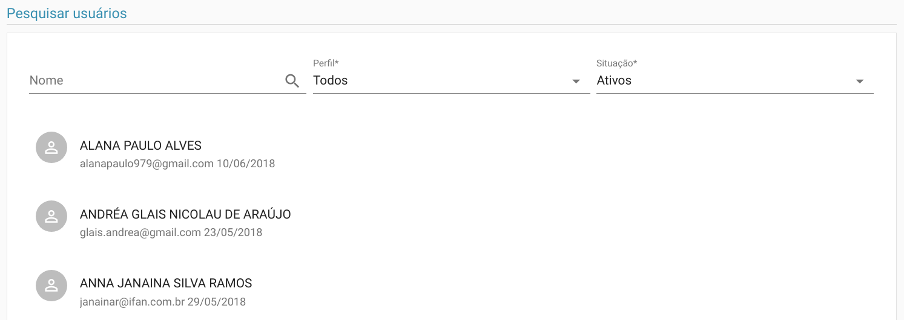
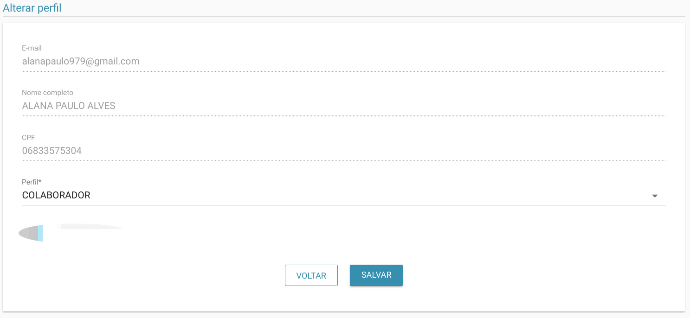

# Usuários

> **Diponibilidade:**
> ADMINISTRADOR

Esta funcionalidade permite a listagem, filtro e alteração do perfil de um determinado usuário.

Veja na tela acima que no momento que entramos nesta tela ele já lista automaticamente os usuários de todos os perfis e que estejam ativos, de acordo com o filtro padrão.
As opções dos filtros podem ser alteradas e dinamicamente novos resultados serão apresentados de acordo com o filtro.

Ao clicar sobre um determinado usuário você será redirecionado para tela de alteração de perfil, onde é possível alterar o perfil do usuário selecionado.

Os perfis possíveis são:
  - ADMINISTRADOR
  - COORDENADOR
  - COLABORADOR
  - ASSISTIDO

### ADMINISTRADOR 
Este perfil possui acesso ilimitado a todas as funcionalidades disponíveis pelo sistema.

### COORDENADOR 
Sendo um COORDENADOR, o usuário possuirá um grande nível de acesso com exceção das funcionalidades relativas a gestão de usuários.

### COLABORADOR 
É um perfil com acesso limitado ao sistema, apenas algumas funcionalidades são liberadas.

### ASSISTIDO
É um perfil ainda não utilizado pelo sistema, mas se visualiza a possibilidade de acesso restrito aos assistidos para consultar informações sobre si mesmo.